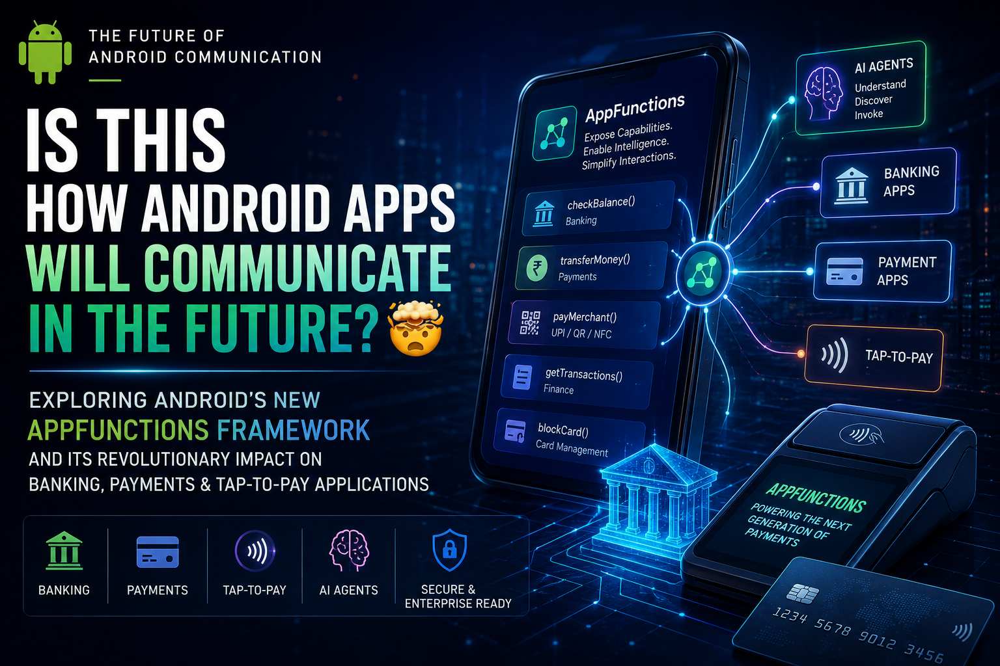

# Android-s-NEW-AppFunctions-Framework

# Is THIS How Android Apps Will Communicate in the Future? 🤯

## Exploring Android's NEW AppFunctions Framework and Its Revolutionary Impact on Banking, Payments & Tap-to-Pay Applications

---

*By Pinankh Patel | Principal Android Engineer | 15+ Years in Android Platform, Fintech & Payment Systems*

---



## Introduction: The Long Arc of Android App Communication

When I first started building Android apps in the early Gingerbread era, inter-app communication was, to put it diplomatically, a creative exercise in workarounds. You fired an Intent and hoped something caught it. You registered a BroadcastReceiver and prayed nothing else on the device was abusing the same action string. Life was genuinely simpler, but the ecosystem was also far less demanding.

Over the last fifteen years, the Android IPC surface has matured significantly — but it has done so in layers, each layer added to solve a specific problem without fully replacing what came before. Today in 2026, a typical Android banking or payment application simultaneously handles Intents, deep links, ContentProvider queries, bound Service connections, BroadcastReceivers for system events, and App Links for web-to-app routing. It's not that these mechanisms are broken. It's that they were never designed to answer a question that is now becoming central to mobile software: *how does an AI agent, operating with user consent, discover and invoke the structured capabilities of an app without screen-scraping, UI automation, or brittle intent hacks?*

That question is what Android AppFunctions was built to answer.

But before I get into AppFunctions specifically, let me be honest about where the existing communication stack falls short — because that context is what makes AppFunctions architecturally interesting rather than just another API to memorize.

### The Traditional Communication Toolkit and Its Ceilings

**Explicit Intents** are reliable for intra-app navigation and targeting a specific component in a partner app when you know its package name. They work. But they're tight-coupled by design. If a bank wants a third-party EMV kernel to expose a "process contactless transaction" capability, both sides need to agree on a private action string, a bundle schema, a result code interpretation — and none of that is machine-discoverable. A new agent or orchestrator has no way to know this capability exists.

**Implicit Intents** introduced discoverability — fire an intent with `ACTION_VIEW` and the system finds something that can handle it. That's elegant for content sharing. It's far less elegant when your use case is "execute a payment" or "query account balance," because the implicit intent model has no semantic schema layer. You can't describe what parameters you accept, what you return, or what permissions protect you — at least not in any structured way that an LLM or agent system can programmatically reason about.

**BroadcastReceivers** are fundamentally fire-and-forget. They carry no return value contract, they've been progressively restricted across Android versions (Android 8.0's background execution limits, Android 9.0's implicit broadcast restrictions), and they are categorically unsuitable for anything resembling transactional, bidirectional communication.

**Bound Services** are the workhorse of structured IPC. AIDL-based services are powerful, low-latency, and genuinely production-grade for scenarios like payment terminal communication or EMV kernel interfaces. But they require both sides to know each other at compile time — the AIDL interface definition is an artifact you have to ship with your app. They don't support runtime discovery, they don't carry semantic metadata, and they are invisible to any system-level orchestration layer.

**ContentProviders** are excellent for structured data exposure — they have a defined query contract, they support permissions, and they've survived relatively intact across Android versions. But they're fundamentally a data-read mechanism. They're not designed for action invocation with complex input/output schemas.

**Deep Links and App Links** brought the web's URL-based linking model into the app ecosystem. They're invaluable for marketing, cross-app navigation, and web-to-app handoff. But they encode parameters in URLs — a format that's human-designed, not machine-typed. A URL parameter is a string. There's no schema, no type safety, no structured error return, and certainly no way for an AI system to understand that `hdfc://transfer?amount=5000&to=john` is a money movement operation that requires authentication, has a daily limit, and returns a transaction reference.

All of these mechanisms share a common architectural ceiling: **they were built for human-initiated, developer-anticipated interaction patterns.** AppFunctions is the first Android IPC primitive explicitly designed for *machine-initiated, AI-orchestrated* interaction — and that distinction changes everything.

---

## What Exactly Is Android AppFunctions?

Let me be precise about the definition, because the marketing framing around "AI" sometimes obscures the actual engineering story.

AppFunctions is an Android platform API with an accompanying Jetpack library to simplify Android MCP integration. It empowers apps to behave like on-device MCP servers, contributing functions that act as tools for use by proactive features along with agents and assistants, like Google Gemini.

The MCP reference is important. Model Context Protocol is Anthropic's open standard for connecting AI models to external tools and data sources. It defines a structured way for a model to discover available tools, understand their parameter schemas, invoke them, and receive typed results. AppFunctions is essentially MCP, but solved for the Android on-device context. While MCP traditionally standardizes how agents connect to server-side tools, AppFunctions provides the same mechanism for Android apps.

The "on-device" part matters enormously for financial applications. When a banking app exposes an `getAccountBalance` function via AppFunctions and Gemini invokes it, **the execution happens entirely within the app's own process, on the device, under the app's own permission model.** No data transits to Google servers. No screen content is parsed. No UI is simulated. The function runs in the bank's own sandbox, the result is returned typed and structured, and the only thing that leaves the device is whatever the app explicitly returns — which, for a balance query, might be a masked balance string and an account suffix.

AppFunctions are available on devices running Android 16 or higher. That's API level 36, which shipped in early 2025. The Jetpack library (`androidx.appfunctions`) backfills some capabilities, but the core platform API — `AppFunctionManager`, `AppFunctionService`, the AppSearch indexing integration — requires Android 16. For fintech teams planning adoption, that means a deployment horizon of 2026–2027 for meaningful install base penetration, depending on your target demographic.

As of May 2026, AppFunctions integration with Gemini is in a private preview with trusted testers. The architecture is stable enough for production preparation now, even if the Gemini-side integration isn't publicly available yet.

### How It Differs from Intents — Architecturally

The deepest architectural difference between AppFunctions and Intents is the **schema layer**.

An Intent is essentially a message envelope with a string-keyed extras bundle. The schema of what goes in that bundle is implicit — it lives in documentation, in the heads of developers who worked on both ends. The system has no semantic understanding of an Intent's contents.

An AppFunction has an explicit, machine-readable schema generated at compile time by the annotation processor. When you annotate a Kotlin function with `@AppFunction`, the KSP (Kotlin Symbol Processing) compiler plugin inspects the function signature — its parameter names, types, nullability, and KDoc descriptions — and generates a structured schema artifact that gets packaged into the APK as `app_functions.xml`. This schema is then indexed by Android's AppSearch at install time, making every AppFunction discoverable through a structured database query.

The implications for AI systems are substantial. An LLM agent can query AppSearch, read the schema for every registered AppFunction on the device, understand what parameters each function requires, and construct a correctly-typed invocation — without any hardcoded knowledge of the specific app. It's genuinely dynamic capability discovery, which is something the Intent system was never capable of.

---

## How AppFunctions Work Under the Hood

Let me walk through the complete lifecycle — from function definition through invocation — because understanding this flow is essential for designing AppFunctions integrations that are actually production-ready.

### Registration: Compile-Time Schema Generation

The process begins with annotation. You annotate Kotlin functions in your `AppFunctionService` subclass with `@AppFunction`. The KSP-based annotation processor then generates two critical artifacts:

1. **`app_functions.xml`** — a structured XML schema describing every registered function: its identifier (fully qualified class name + method name), its parameter names and types, its return type, and descriptive metadata derived from KDoc.

2. **Kotlin binding classes** — generated type-safe wrappers that handle serialization/deserialization of function parameters and results into/from `AppFunctionData` objects.

This schema is embedded in the APK and read by the OS at install time.

### Discovery: AppSearch Indexing

An assistant app should first list all available app functions as `AppFunctionStaticMetadata` documents from AppSearch.

The Android OS indexes the `app_functions.xml` schema into AppSearch — Android's on-device, full-text searchable structured database — as part of the app installation process. `AppFunctionManager` provides the query interface: callers can search for functions by type, by capability descriptor, or across all installed apps. The search is semantic-metadata-level, not function-body-level — you're querying schema documents, not app code.

This AppSearch integration is architecturally significant because it means **function discovery has zero runtime overhead against the app being called.** The agent queries AppSearch (the OS index), identifies a matching function, then invokes it. The app being called is not involved in the discovery phase at all.

### Invocation: Binder-Based IPC

When a caller invokes an AppFunction via `AppFunctionManager.executeAppFunction()`, the OS uses standard Android Binder IPC to route the call to the target app's `AppFunctionService`. The service must be declared in `AndroidManifest.xml` and configured via `AppFunctionConfiguration`.

The execution model is important: **the function runs in the target app's process.** It runs under the target app's user ID, within its sandbox, with access to its data. The caller — even if it's Gemini — does not gain any elevated access to the target app's data beyond what the function explicitly returns. The sandboxing is enforced at the OS level.

### Permissions: A Restricted Caller Model

The agent app must declare a permission in the manifest: `android.permission.EXECUTE_APP_FUNCTIONS`. Therefore, only official apps like those from Google/Gemini and OEMs are permitted to call these app functions.

This is a critically important security property. `EXECUTE_APP_FUNCTIONS` is a restricted permission — not a normal or dangerous permission that any app can declare and be granted by the user. It is a privileged system-level permission. If an app attempts to use this, a SecurityException will occur because this is a restricted API, accessible only to system apps.

What this means in practice: third-party apps cannot discover or invoke each other's AppFunctions. The caller must be a system-privileged app — Gemini, OEM assistants, or potentially Google's own first-party apps. For fintech developers, this is a feature, not a limitation. It prevents a rogue app from calling your bank's `transferFunds` AppFunction. The trust boundary is enforced at the OS level.

### Execution Lifecycle

```
[Agent / Gemini]
     |
     | AppFunctionManager.executeAppFunction()
     |
[AppFunctionManager - System Service]
     |
     | Binder IPC (via EXECUTE_APP_FUNCTIONS permission check)
     |
[AppFunctionService - Target App Process]
     |
     | Deserialize AppFunctionData -> Kotlin parameters (generated code)
     |
[Your @AppFunction method - runs in app's coroutine scope]
     |
     | Serialize result -> AppFunctionData
     |
[Return to caller via Binder]
     |
[Agent receives typed result]
```

The execution is fully asynchronous — AppFunctions are `suspend` functions, running in a coroutine context managed by the `AppFunctionService`. The caller awaits the result via a `ListenableFuture` or coroutine continuation.

### Architecture Diagram: AppFunctions System Topology

```
┌─────────────────────────────────────────────────────────────────┐
│                         ANDROID DEVICE                          │
│                                                                 │
│  ┌──────────────────┐         ┌──────────────────────────────┐  │
│  │   AI AGENT LAYER │         │    APP FUNCTIONS REGISTRY    │  │
│  │                  │         │    (AppSearch + OS Index)    │  │
│  │  Gemini / OEM    │──Query──▶  AppFunctionStaticMetadata  │  │
│  │  Assistant App   │         │  • Function schema          │  │
│  │  (EXECUTE_APP_   │◀─Match──│  • Parameter types          │  │
│  │  FUNCTIONS perm) │         │  • KDoc descriptions        │  │
│  └────────┬─────────┘         └──────────────────────────────┘  │
│           │                                                     │
│           │ executeAppFunction() via AppFunctionManager          │
│           │                                                     │
│           ▼ Binder IPC                                          │
│  ┌──────────────────────────────────────────────────────────┐   │
│  │              TARGET APP PROCESS (e.g. Bank App)          │   │
│  │                                                          │   │
│  │  ┌─────────────────────────────────────────────────┐     │   │
│  │  │              AppFunctionService                  │     │   │
│  │  │   Deserialize AppFunctionData → Kotlin types    │     │   │
│  │  │   Route to @AppFunction method                  │     │   │
│  │  │   Execute in coroutine scope                    │     │   │
│  │  │   Serialize result → AppFunctionData            │     │   │
│  │  └─────────────────────────────────────────────────┘     │   │
│  │                    │                                      │   │
│  │                    ▼                                      │   │
│  │  ┌─────────────────────────────────────────────────┐     │   │
│  │  │         APPLICATION BUSINESS LOGIC              │     │   │
│  │  │   Repository → Use Case → Domain Model          │     │   │
│  │  │   Accesses local DB, Keystore, Network          │     │   │
│  │  └─────────────────────────────────────────────────┘     │   │
│  └──────────────────────────────────────────────────────────┘   │
└─────────────────────────────────────────────────────────────────┘
```

---

## AppFunctions vs Traditional Android Communication: A Technical Comparison

The following tables reflect my assessment after working with all of these mechanisms in production environments, including high-security fintech contexts.

### Table 1: Mechanism Comparison Matrix

| Mechanism | Discovery | Type Safety | Return Contract | AI-Ready | Security Boundary |
|---|---|---|---|---|---|
| Explicit Intent | None (compile-time) | No | Weak (onActivityResult) | No | Package name only |
| Implicit Intent | String action matching | No | Very weak | No | Intent filter |
| Deep Link / App Link | URL pattern matching | No (URL strings) | None | No | Domain verification |
| BroadcastReceiver | String action matching | No | None (fire & forget) | No | Broadcast permissions |
| Bound Service (AIDL) | None | Yes (AIDL types) | Strong | No | Permission |
| ContentProvider | None | Partial (Cursor) | Query result | No | Read/write permission |
| AppFunctions | AppSearch semantic query | Yes (Kotlin types) | Structured schema | **Yes** | System-privileged |

### Table 2: Fintech / Banking Fitness

| Requirement | Intents | Deep Links | Bound Services | AppFunctions |
|---|---|---|---|---|
| On-device execution | ✓ | ✓ | ✓ | ✓ |
| No data leaves device | ✓ | ✓ | ✓ | ✓ |
| Structured schema | ✗ | ✗ | Partial | ✓ |
| AI agent invocable | ✗ | ✗ | ✗ | ✓ |
| Runtime discoverability | ✗ | ✗ | ✗ | ✓ |
| Caller trust enforcement | Partial | Partial | ✓ | ✓ (system-only) |
| Asynchronous / suspend | Partial | ✗ | ✓ | ✓ |
| Type-safe params | ✗ | ✗ | ✓ | ✓ |
| Wear OS / multi-form | ✗ | ✗ | Partial | ✓ |

### Table 3: Developer Experience

| Factor | Bound Services | AppFunctions |
|---|---|---|
| Boilerplate | High (AIDL, ServiceConnection) | Low (annotations + KSP) |
| Schema evolution | Manual AIDL versioning | KDoc + annotation evolution |
| Testability | Complex mock services | ADB shell commands + testing agent |
| Documentation for agents | None | KDoc → schema → LLM context |
| Backward compat | Full (any API) | Android 16+ only |

---

## Why This Is a Game Changer for Banking Applications

I've spent a meaningful portion of my career building and reviewing Android architectures for banks, payment processors, and fintech startups — across India, Southeast Asia, and the Middle East. The recurring engineering challenge is always the same: *how do you give users the ability to accomplish financial tasks quickly, naturally, and safely, without exposing sensitive operations to untrusted callers?*

AppFunctions changes the calculus in ways that took me a while to fully appreciate.

### Mobile Banking: Account and Card Management

Consider a user asking Gemini on their device: *"What's my HDFC savings account balance?"*

With the old world: Gemini has no way to answer this. It either performs a web search (useless for account-specific data), opens the bank app (navigational, not informational), or says it can't help. All of these are bad user experiences.

With AppFunctions, if HDFC has implemented an `getAccountBalance` function:

1. Gemini queries AppSearch, finds HDFC's registered `getAccountBalance` AppFunction
2. Gemini invokes it with the function identifier
3. The function runs inside the HDFC app process — behind the app's biometric/PIN authentication layer
4. HDFC returns a structured response: `AccountBalanceResult(maskedAccountNumber = "XXXX-1234", balance = "₹45,210", currency = "INR", lastUpdated = ...)`
5. Gemini surfaces this to the user in the conversation

The key engineering point: **the bank app controls what it returns.** It can enforce re-authentication before returning sensitive data. It can return masked values. It can log the invocation in its own audit trail. It can refuse the invocation if the user hasn't authenticated within the last N minutes. None of this is controlled by Gemini — it's entirely within the bank app's own `@AppFunction` implementation.

Here's what a complete banking AppFunction suite might look like:

```kotlin
// Account queries
@AppFunction(isDescribedByKDoc = true)
suspend fun getAccountBalance(
    context: AppFunctionContext,
    /** The account ID to query. Defaults to primary savings account if null. */
    accountId: String? = null
): AccountBalanceResult

@AppFunction(isDescribedByKDoc = true)
suspend fun getTransactionHistory(
    context: AppFunctionContext,
    /** Account ID to query */
    accountId: String,
    /** Number of most recent transactions to return. Max 50. */
    count: Int = 10,
    /** Optional filter: 'debit', 'credit', or null for all */
    transactionType: String? = null
): TransactionHistoryResult

@AppFunction(isDescribedByKDoc = true)
suspend fun getBeneficiaryList(
    context: AppFunctionContext,
    /** Optional search term to filter beneficiaries by name */
    searchQuery: String? = null
): BeneficiaryListResult

@AppFunction(isDescribedByKDoc = true)
suspend fun blockCard(
    context: AppFunctionContext,
    /** The card ID to block */
    cardId: String,
    /** Reason for blocking: 'lost', 'stolen', 'suspicious_activity' */
    reason: String
): CardActionResult
```

Notice the KDoc on every parameter. When `isDescribedByKDoc = true` is set, the annotation processor folds the KDoc into the schema, giving the AI agent rich semantic context about what each parameter means. This is the difference between an agent that correctly constructs invocations and one that makes parameter errors.

### The Banking AI Assistant Flow

The following interaction chain illustrates how a complete AI-driven banking session would work:

**User:** *"Transfer ₹5000 to Rajesh for the electricity bill"*

**Gemini's reasoning chain (internal):**
1. Intent: Fund transfer
2. Query AppSearch for `transfer` / `payment` AppFunctions
3. Find `initiateTransfer(amount, recipientName, purpose)` from the bank app
4. Parameters: amount=5000, recipientName="Rajesh", purpose="electricity bill"
5. Invoke AppFunction

**Bank App's `initiateTransfer` implementation:**
```kotlin
@AppFunction(isDescribedByKDoc = true)
suspend fun initiateTransfer(
    context: AppFunctionContext,
    /**
     * Transfer amount in INR paise (e.g., 500000 = ₹5000).
     * Maximum single-transaction limit: ₹200,000.
     */
    amountPaise: Long,
    /**
     * Beneficiary name or UPI ID. System will fuzzy-match against
     * registered beneficiaries. Exact UPI ID preferred.
     */
    recipient: String,
    /** Optional narration / purpose of payment. Max 50 characters. */
    narration: String? = null
): TransferInitiationResult {
    // Step 1: Re-authenticate. Non-negotiable for fund movements.
    val authResult = biometricAuthManager.requireRecentAuth(
        maxAgeSeconds = 30,
        reason = "Authorize transfer of ₹${amountPaise/100} to $recipient"
    )
    if (!authResult.isAuthorized) {
        throw AppFunctionElementNotFoundException(
            "Authentication required to initiate transfer"
        )
    }

    // Step 2: Resolve recipient
    val resolvedBeneficiary = beneficiaryRepository.fuzzyMatch(recipient)
        ?: return TransferInitiationResult(
            status = "RECIPIENT_NOT_FOUND",
            message = "No registered beneficiary matching '$recipient'. Please add them first."
        )

    // Step 3: Risk check
    val riskScore = fraudEngine.evaluateTransfer(
        amount = amountPaise,
        beneficiaryId = resolvedBeneficiary.id,
        deviceContext = context.extras
    )
    if (riskScore > RISK_THRESHOLD) {
        return TransferInitiationResult(
            status = "RISK_FLAGGED",
            message = "Transaction flagged for additional verification. Please open the app."
        )
    }

    // Step 4: Initiate (returns pending state for user to confirm in app)
    val pendingTransfer = transferRepository.initiatePending(
        amount = amountPaise,
        beneficiary = resolvedBeneficiary,
        narration = narration
    )

    return TransferInitiationResult(
        status = "PENDING_CONFIRMATION",
        transferId = pendingTransfer.id,
        message = "Transfer of ₹${amountPaise/100} to ${resolvedBeneficiary.displayName} is ready. Open the app to confirm.",
        deepLinkToConfirm = "hdfc://transfer/confirm/${pendingTransfer.id}"
    )
}
```

This implementation illustrates the correct pattern for sensitive operations: **AppFunctions initiate the flow, but final confirmation happens in the app's own UI.** You never complete a fund transfer purely via an AppFunction invocation — you return a pending state and a deep link that opens the app's confirmation screen. This keeps the sensitive confirmation step in an authenticated, audited, bank-controlled surface.

---

## The Future of Tap-to-Pay Applications

This is the section I find most compelling as someone who has shipped EMV contactless payment stacks on Android. The potential impact of AppFunctions on payment terminals, SoftPOS, and the broader merchant ecosystem is substantial — and largely unexplored in public discourse.

### The Current SoftPOS Architecture

A modern SoftPOS (Software Point of Sale) implementation on an Android device has roughly this architecture:

```
[Merchant Application]
        |
        | Android NFC Intent / HCE APIs
        |
[EMV Contactless Kernel]
  (Visa payWave / Mastercard Tap & Go / RuPay Contactless)
        |
        | ISO 7816 APDUs over NFC
        |
[Cardholder Device - HCE or Physical Card]
        |
        | Kernel processes: SELECT, GPO, READ RECORD, GENERATE AC
        |
[Transaction Authorization Record]
        |
        | Acquirer connection (TLS 1.3)
        |
[Payment Gateway / Acquirer Host]
        |
[Issuer Authorization (online) or Floor Limit (offline)]
```

The challenge: the merchant application sits at the top of this stack with very limited visibility into what happens below. When an agent — merchant AI assistant, inventory system, or POS orchestration layer — wants to trigger a payment, it currently has no clean interface to do so. It fires an Intent at the payment app, receives a result code, and parses a flat extras bundle. There's no structured schema, no semantic metadata, no way for the orchestrator to understand what payment methods are supported, what transaction limits apply, or what state the terminal is in.

### AppFunctions for Merchant Payment Orchestration

Imagine a SoftPOS application exposing the following AppFunctions:

```kotlin
/**
 * Initialize a payment transaction session.
 * Call this before any tap-to-pay or QR payment flow.
 * Terminal must be in READY state. Returns a session token.
 */
@AppFunction(isDescribedByKDoc = true)
suspend fun initializeTransaction(
    context: AppFunctionContext,
    /** Transaction amount in paise (smallest currency unit). */
    amountPaise: Long,
    /** ISO 4217 currency code. Default: INR */
    currencyCode: String = "INR",
    /** Optional merchant reference for reconciliation. Max 20 chars. */
    merchantRef: String? = null,
    /** Payment methods to accept: NFC_CONTACTLESS, QR_UPI, CARD_SWIPE */
    acceptedMethods: List<String> = listOf("NFC_CONTACTLESS", "QR_UPI")
): TransactionSessionResult

/**
 * Query the current terminal status and capabilities.
 * Use before initiating transactions to confirm readiness.
 */
@AppFunction(isDescribedByKDoc = true)
suspend fun getTerminalStatus(
    context: AppFunctionContext
): TerminalStatusResult

/**
 * Retrieve the last N completed transactions for reconciliation.
 */
@AppFunction(isDescribedByKDoc = true)
suspend fun getTransactionHistory(
    context: AppFunctionContext,
    /** Number of records. Maximum 100. */
    count: Int = 10,
    /** Filter by status: APPROVED, DECLINED, REVERSED, or null for all */
    status: String? = null
): MerchantTransactionHistoryResult

/**
 * Initiate a refund for a previously completed transaction.
 * Requires supervisor authentication.
 */
@AppFunction(isDescribedByKDoc = true)
suspend fun initiateRefund(
    context: AppFunctionContext,
    /** Original transaction ID to refund */
    originalTransactionId: String,
    /** Refund amount in paise. Must be <= original amount. */
    refundAmountPaise: Long,
    /** Reason code: CUSTOMER_REQUEST, DEFECTIVE_PRODUCT, etc. */
    reasonCode: String
): RefundInitiationResult
```

Now consider the POS orchestration scenario: a merchant AI assistant (running as a privileged OEM system application) receives a voice command from the merchant — *"Process a return for table 7's ₹850 tikka masala order."* The assistant:

1. Queries AppSearch, discovers the SoftPOS app's `initiateRefund` function
2. Looks up the transaction in the billing system (via its own integration)
3. Invokes `initiateRefund` with the original transaction ID and amount
4. The SoftPOS app handles supervisor auth, EMV refund flow, acquirer communication
5. Returns structured result with refund approval code and receipt reference

This kind of multi-step, cross-app orchestration is genuinely impossible with the current Intent-based model. The schema layer is what makes it work — the AI assistant can construct a correct `initiateRefund` invocation because the schema tells it exactly what parameters the function expects, in what format, with what constraints.

### NFC and EMV: The Deeper Technical Reality

I want to be precise about where AppFunctions fits in the EMV stack, because there's a real risk of architectural confusion here.

AppFunctions do **not** replace or touch the NFC transaction itself. The actual contactless payment flow — NFC discovery, APDU exchange, EMV kernel processing, cryptogram generation — all happens at a layer below the AppFunctions integration. AppFunctions operates at the *business logic* layer: initiating transactions, querying status, handling post-transaction flows.

The NFC contactless transaction pipeline remains:

```
[SoftPOS EMV Kernel (e.g., Visa payWave v3.1, MC M/Chip Advance)]
        |
[Android NFC API - NfcAdapter, IsoDep]
        |
[NFC Controller - hardware]
        |
[RF Field - ISO/IEC 14443 Type A/B]
        |
[Cardholder Card / HCE Device]
```

AppFunctions wraps the *management* of this pipeline — triggering transaction sessions, querying results, handling merchant-facing flows. The EMV kernel itself is unaffected. This is the correct architectural boundary.

For Visa and Mastercard certification compliance, this distinction is critical. EMV kernels have strict requirements about how they are invoked and what happens to transaction data. AppFunctions at the business logic layer does not break any of these requirements — the kernel receives its inputs through its own interfaces, not through AppFunctions.

### The RuPay and UPI Dimension

For the Indian payment ecosystem specifically, AppFunctions opens interesting possibilities. UPI (Unified Payments Interface) is already an Intent-based ecosystem — PSP apps register Intent handlers for UPI payment URIs. But the UPI Intent model has exactly the limitations I described earlier: string parameters, no structured schema, no semantic metadata for AI systems.

A UPI-AppFunctions hybrid model could look like:

```kotlin
@AppFunction(isDescribedByKDoc = true)
suspend fun initiateUPIPayment(
    context: AppFunctionContext,
    /** UPI ID of the recipient (e.g., name@bank) */
    recipientUpiId: String,
    /** Payment amount in paise */
    amountPaise: Long,
    /** Transaction note. Max 50 characters. */
    note: String? = null,
    /** Merchant category code for merchant payments */
    merchantCategoryCode: String? = null
): UPIPaymentResult

@AppFunction(isDescribedByKDoc = true)
suspend fun verifyUPIId(
    context: AppFunctionContext,
    /** UPI ID to validate and look up */
    upiId: String
): UPIIdVerificationResult
```

The AI assistant scenario becomes: *"Pay my electricity bill via GPay."* Google Pay (if it registers an `initiateUPIPayment` AppFunction) is discovered by Gemini, invoked with the biller's UPI ID and amount, and handles the UPI flow internally. The user gets a confirmation request in the GPay UI. Done.

---

## Enterprise Payment Architecture: A Complete Stack

Let me describe an end-to-end enterprise payment architecture with AppFunctions as the orchestration layer. This is the architecture I'd recommend to a payment solution provider building for Android POS in 2026.

```
┌──────────────────────────────────────────────────────────────────────┐
│                    MERCHANT BUSINESS LAYER                           │
│                                                                      │
│  [POS Orchestration App / Merchant AI Assistant]                     │
│  • Order management                                                  │
│  • Inventory integration                                             │
│  • Customer management                                               │
│  ↓  AppFunctions invocation (via EXECUTE_APP_FUNCTIONS)              │
├──────────────────────────────────────────────────────────────────────┤
│                    APPFUNCTIONS LAYER                                │
│                                                                      │
│  @AppFunction: initializeTransaction()                               │
│  @AppFunction: getTerminalStatus()                                   │
│  @AppFunction: initiateRefund()                                      │
│  @AppFunction: getTransactionHistory()                               │
│  @AppFunction: applyDiscount()                                       │
│  ↓  Internal dispatch to Payment SDK                                 │
├──────────────────────────────────────────────────────────────────────┤
│                    PAYMENT SDK LAYER                                 │
│                                                                      │
│  • Transaction lifecycle management                                  │
│  • Authentication & tokenization (network tokens)                    │
│  • Receipt generation                                                │
│  • Offline capability / floor limit management                       │
│  ↓  EMV kernel API                                                   │
├──────────────────────────────────────────────────────────────────────┤
│                    EMV KERNEL LAYER                                  │
│                                                                      │
│  • Visa payWave v3.x / ADVT / qVSDC                                  │
│  • Mastercard M/Chip Advance / MCL                                   │
│  • RuPay Contactless (Appendix J)                                    │
│  • American Express ExpressPay                                       │
│  • EMV tag processing (TLV parsing/encoding)                         │
│  • Cryptogram verification (ARQC, TC, AAC)                           │
│  ↓  Android NFC API                                                  │
├──────────────────────────────────────────────────────────────────────┤
│                    NFC STACK                                         │
│                                                                      │
│  • NfcAdapter (android.nfc)                                          │
│  • IsoDep (ISO/IEC 14443-4 transport)                                │
│  • NFC Controller (hardware via HAL)                                 │
│  • RF Field (13.56 MHz, ISO 14443 Type A/B)                          │
│  ↓  Network connectivity                                             │
├──────────────────────────────────────────────────────────────────────┤
│                    ACQUIRER COMMUNICATION LAYER                      │
│                                                                      │
│  • ISO 8583 message formatting                                       │
│  • TLS 1.3 transport (mutual authentication)                         │
│  • HSM-signed MAC generation                                         │
│  ↓                                                                   │
│  [ACQUIRER HOST / PAYMENT GATEWAY]                                   │
│  ↓                                                                   │
│  [ISSUER BANK - Online Authorization]                                │
│  (VISA / MC / RuPay network switch)                                  │
└──────────────────────────────────────────────────────────────────────┘
```

Every layer here has distinct responsibilities. AppFunctions occupies the narrow but critical zone between business logic orchestration and payment SDK invocation. Its job is to be the structured API surface that intelligent callers — AI assistants, orchestration systems, multi-app POS configurations — use to drive the payment flow. The EMV kernel, NFC stack, and acquirer communication layers are entirely independent of the AppFunctions integration and should remain so.

---

## Security Implications: What Fintech Engineers Must Understand

Security is where I spend the most time in AppFunctions architecture reviews, because the threat model for banking functions is fundamentally different from note-taking or task management.

### The Caller Trust Hierarchy

The most important security property to understand: **AppFunctions callers are system-privileged.** The `EXECUTE_APP_FUNCTIONS` permission is not grantable by users — it requires system-level privilege. This means your AppFunctions can only be called by:

- Google Gemini (and other Google assistant surfaces)
- OEM assistant applications with system privilege (Samsung's Bixby with appropriate signing, for example)
- Custom enterprise device management apps that have been signed with the device's platform key

This is a dramatically narrower caller surface than Intents or deep links, where literally any app can fire an Intent or open a deep link. For financial applications, this is the right starting point.

### Authentication Within AppFunctions

The caller trust model does not replace in-function authentication. For any AppFunction that accesses or modifies sensitive financial data, I recommend a layered authentication approach:

```kotlin
@AppFunction(isDescribedByKDoc = true)
suspend fun getAccountBalance(
    context: AppFunctionContext,
    accountId: String? = null
): AccountBalanceResult {

    // Layer 1: Verify caller identity from context
    // context.callerPackageName is provided by the OS - cannot be spoofed
    val callerPackage = context.callerPackageName
    auditLogger.log("AppFunction invocation", callerPackage, "getAccountBalance")

    // Layer 2: Check session freshness
    val session = sessionManager.getCurrentSession()
    if (session == null || session.isExpired()) {
        return AccountBalanceResult(
            status = "AUTHENTICATION_REQUIRED",
            message = "Please open the app to authenticate."
        )
    }

    // Layer 3: For sensitive data, check biometric recency
    val biometricAge = biometricAuthManager.getLastAuthAgeSeconds()
    if (biometricAge > SESSION_TIMEOUT_SECONDS) {
        return AccountBalanceResult(
            status = "REAUTH_REQUIRED",
            message = "Session expired. Biometric required.",
            deepLinkToAuth = "bankapp://auth?returnTo=balance"
        )
    }

    // Only now access actual data
    val balance = accountRepository.getBalance(
        accountId ?: session.primaryAccountId
    )

    return AccountBalanceResult(
        status = "SUCCESS",
        maskedAccountNumber = balance.maskedNumber,
        availableBalance = balance.available,
        currency = balance.currency
    )
}
```

### PCI DSS and AppFunctions

For payment applications, PCI DSS requirements do not disappear because you've added an AppFunction layer. The relevant considerations:

**PCI DSS Requirement 3 (Stored Data Protection):** AppFunctions never return raw PANs, CVVs, or full card numbers. If a function returns card information, it returns tokenized card references or masked values. This is a design requirement, not a nice-to-have.

**PCI DSS Requirement 6 (Secure Development):** The AppFunction schema generation happens at compile time via KSP. The generated code is deterministic and auditable. Include the schema XML in your PCI audit artifacts — it documents your exposed API surface.

**PCI DSS Requirement 10 (Logging and Monitoring):** Every AppFunction invocation should be logged with: caller package name (from `AppFunctionContext`), timestamp, function identifier, parameter summary (not values for sensitive fields), result status, and user session reference. This creates an audit trail for every AI-initiated financial operation.

**EMV 3DS and Tokenization:** AppFunctions that initiate payment flows should use network tokens (Visa Token Service, Mastercard Digital Enablement Service) rather than raw PANs. The tokenization layer sits below the AppFunction implementation — the function initiates a tokenized transaction, not a raw PAN transaction.

### Sandboxing and Data Isolation

The Android sandbox guarantees that even if Gemini calls your AppFunction, it executes in your app's process under your app's UID. Gemini cannot read your app's database, SharedPreferences, or Keystore entries — it only receives what your function explicitly returns. This is a stronger isolation than most banking apps have when dealing with third-party SDKs linked into their own process.

---

## Performance Considerations

### IPC Overhead

AppFunctions use standard Binder IPC. A Binder transaction round-trip on a modern Android device is typically in the **50–200 microsecond** range for simple payloads. For a balance query returning a few hundred bytes, the IPC overhead is negligible compared to network latency.

The AppSearch query during discovery is more interesting. AppSearch operates on an in-memory index for hot queries, with persistence to SQLite on disk. Benchmark observations on Pixel 8 class hardware:

| Operation | Typical Latency |
|---|---|
| AppSearch function discovery query | 2–15ms |
| Binder invocation (small payload < 1KB) | 0.1–0.5ms |
| Function execution (local data access) | 5–50ms |
| Function execution (network required) | 300ms–2s |
| Schema indexing at install | 50–200ms (one-time) |

For payment terminals where latency matters, the local-data-access path (account balance from local cache, terminal status query) is fast enough to be imperceptible. For network-dependent operations (live balance from core banking, transaction authorization), the latency is dominated by network round-trip, not AppFunctions overhead.

### Memory and Battery

AppFunctions are executed as `suspend` functions within the existing `AppFunctionService` process. There's no separate process spawn for each invocation — the service is started once by the Binder call and remains running during the execution.

Battery impact is proportional to what your AppFunction actually does. A function that reads from Room database and returns a cached balance uses trivially more battery than a direct user interaction. A function that triggers a network call to core banking uses the same battery as any network request. The AppFunctions framework itself adds no meaningful battery overhead beyond standard IPC costs.

### Cold Start Latency

The one performance concern worth flagging: if your app process is not running when an AppFunction is invoked, the OS must cold-start it before executing the function. Cold start for a modern Kotlin Android app with Hilt and Room initialization can be 500ms–2 seconds on a mid-range device. For an AI assistant asking "what's my balance?", waiting 1.5 seconds for an app cold start before even beginning the function execution is a degraded experience.

**Mitigation strategies:**

```kotlin
// 1. Lightweight AppFunctionService with minimal dependencies
// Don't inject your entire Hilt component graph into the service
class BankingAppFunctionService : AppFunctionService() {
    // Inject only what's needed for function execution
    // Use lazy initialization for expensive components
    private val accountRepository by lazy {
        AccountRepository(
            database = AppDatabase.getMinimalInstance(applicationContext),
            apiService = createLightweightApiService()
        )
    }
}

// 2. Implement a local cache that survives across process restarts
// Room with disk persistence ensures cached data is available
// immediately after cold start without a network round-trip
@Entity(tableName = "account_cache")
data class CachedAccountBalance(
    @PrimaryKey val accountId: String,
    val balance: Long,
    val lastUpdated: Long,
    val expiresAt: Long  // Cache invalidation
)
```

---

## Practical Kotlin Implementation: Production-Quality Code

### Project Setup

```kotlin
// build.gradle.kts (app module)
dependencies {
    implementation("androidx.appfunctions:appfunctions:1.0.0-alpha08")
    ksp("androidx.appfunctions:appfunctions-compiler:1.0.0-alpha08")
}
```

```xml
<!-- AndroidManifest.xml -->
<service
    android:name=".appfunctions.BankingAppFunctionService"
    android:exported="true"
    android:permission="android.permission.EXECUTE_APP_FUNCTIONS">
    <intent-filter>
        <action android:name="android.app.appfunctions.AppFunctionService" />
    </intent-filter>
</service>
```

### AppFunctionService Implementation

```kotlin
// BankingAppFunctionService.kt
@AndroidEntryPoint
class BankingAppFunctionService : AppFunctionService() {

    @Inject lateinit var accountRepository: AccountRepository
    @Inject lateinit var authManager: BiometricAuthManager
    @Inject lateinit var auditLogger: AuditLogger
    @Inject lateinit var fraudEngine: FraudDetectionEngine

    /**
     * Returns the available balance for the specified account.
     * Requires an active authenticated session. Returns masked
     * account number for security. Balance is from local cache
     * if available, refreshed from core banking otherwise.
     *
     * @param accountId The account to query. Defaults to primary account.
     * @return [AccountBalanceResult] with masked number and available balance.
     */
    @AppFunction(isDescribedByKDoc = true)
    suspend fun getAccountBalance(
        context: AppFunctionContext,
        accountId: String? = null
    ): AccountBalanceResult {
        auditLogger.logFunctionInvoked(
            caller = context.callerPackageName,
            function = "getAccountBalance",
            userId = authManager.currentUserId()
        )

        val session = authManager.getCurrentSession()
            ?: return AccountBalanceResult(
                status = AccountBalanceResult.STATUS_AUTH_REQUIRED,
                message = "Authentication required."
            )

        return try {
            val account = accountRepository.getAccountWithBalance(
                accountId ?: session.primaryAccountId
            )
            AccountBalanceResult(
                status = AccountBalanceResult.STATUS_SUCCESS,
                maskedAccountNumber = account.maskedNumber,
                availableBalance = account.availableBalance,
                currency = account.currency,
                lastRefreshed = account.lastRefreshed
            )
        } catch (e: AccountNotFoundException) {
            AccountBalanceResult(
                status = AccountBalanceResult.STATUS_NOT_FOUND,
                message = "Account not found."
            )
        }
    }

    /**
     * Retrieves recent transactions for the specified account.
     * Supports filtering by transaction type and count.
     *
     * @param accountId Account to query.
     * @param count Number of transactions to return. Maximum 50.
     * @param transactionType Filter type: 'DEBIT', 'CREDIT', or null for all.
     */
    @AppFunction(isDescribedByKDoc = true)
    suspend fun getTransactionHistory(
        context: AppFunctionContext,
        accountId: String,
        count: Int = 10,
        transactionType: String? = null
    ): TransactionHistoryResult {
        val session = authManager.getCurrentSession()
            ?: return TransactionHistoryResult(
                status = TransactionHistoryResult.STATUS_AUTH_REQUIRED
            )

        val transactions = accountRepository.getTransactions(
            accountId = accountId,
            limit = count.coerceIn(1, 50),
            type = transactionType
        )

        return TransactionHistoryResult(
            status = TransactionHistoryResult.STATUS_SUCCESS,
            transactions = transactions.map { txn ->
                TransactionSummary(
                    id = txn.id,
                    amount = txn.amount,
                    type = txn.type,
                    description = txn.description,
                    date = txn.date,
                    balance = txn.runningBalance
                )
            }
        )
    }
}
```

### Serializable Result Types

```kotlin
// AppFunction result types — must be annotated with @AppFunctionSerializable
@AppFunctionSerializable
data class AccountBalanceResult(
    val status: String,
    val maskedAccountNumber: String? = null,
    val availableBalance: Long? = null,  // in paise
    val currency: String? = null,
    val lastRefreshed: Long? = null,     // epoch millis
    val message: String? = null
) {
    companion object {
        const val STATUS_SUCCESS = "SUCCESS"
        const val STATUS_AUTH_REQUIRED = "AUTHENTICATION_REQUIRED"
        const val STATUS_NOT_FOUND = "NOT_FOUND"
        const val STATUS_ERROR = "ERROR"
    }
}

@AppFunctionSerializable
data class TransactionSummary(
    val id: String,
    val amount: Long,       // in paise, signed (+credit, -debit)
    val type: String,       // DEBIT or CREDIT
    val description: String,
    val date: Long,         // epoch millis
    val balance: Long?      // running balance after transaction
)

@AppFunctionSerializable
data class TransactionHistoryResult(
    val status: String,
    val transactions: List<TransactionSummary> = emptyList(),
    val message: String? = null
) {
    companion object {
        const val STATUS_SUCCESS = "SUCCESS"
        const val STATUS_AUTH_REQUIRED = "AUTHENTICATION_REQUIRED"
    }
}
```

### SoftPOS / Tap-to-Pay AppFunction Example

```kotlin
/**
 * Initializes a contactless payment session on this terminal.
 * The terminal must be in IDLE state. Returns a session token
 * that expires after 120 seconds.
 *
 * @param amountPaise Transaction amount in paise (e.g., 100000 = ₹1000).
 * @param currencyCode ISO 4217 code. Default INR.
 * @param merchantRef Optional merchant order reference for reconciliation.
 */
@AppFunction(isDescribedByKDoc = true)
suspend fun initializeContactlessSession(
    context: AppFunctionContext,
    amountPaise: Long,
    currencyCode: String = "356", // 356 = INR in ISO 4217
    merchantRef: String? = null
): ContactlessSessionResult {

    // Validate terminal state
    val terminalState = terminalStateManager.getCurrentState()
    if (terminalState != TerminalState.IDLE) {
        return ContactlessSessionResult(
            status = "TERMINAL_BUSY",
            message = "Terminal is currently processing another transaction. State: $terminalState"
        )
    }

    // Validate amount
    if (amountPaise <= 0 || amountPaise > MAX_CONTACTLESS_LIMIT_PAISE) {
        return ContactlessSessionResult(
            status = "INVALID_AMOUNT",
            message = "Amount must be between ₹1 and ₹${MAX_CONTACTLESS_LIMIT_PAISE / 100}"
        )
    }

    // Initialize EMV kernel session
    val kernelSession = emvKernelManager.prepareContactlessSession(
        amount = amountPaise,
        currencyCode = currencyCode,
        merchantRef = merchantRef,
        supportedKernels = listOf(
            EmvKernel.VISA_PAYWAVE,
            EmvKernel.MASTERCARD_MCL,
            EmvKernel.RUPAY_CONTACTLESS,
            EmvKernel.AMEX_EXPRESSPAY
        )
    )

    return ContactlessSessionResult(
        status = "READY",
        sessionToken = kernelSession.sessionToken,
        expiresAt = kernelSession.expiresAt,
        supportedMethods = kernelSession.supportedPaymentMethods,
        message = "Terminal ready. Please tap card or device."
    )
}

private companion object {
    const val MAX_CONTACTLESS_LIMIT_PAISE = 500000L // ₹5000 RBI contactless limit
}
```

### Testing AppFunctions via ADB

```bash
# List all registered AppFunctions for your app
adb shell cmd app_function list-app-functions --package com.yourbank.android

# Execute a specific function from the command line
adb shell "cmd app_function execute-app-function \
  --package com.yourbank.android \
  --function com.yourbank.appfunctions.BankingAppFunctionService#getTransactionHistory \
  --parameters '{\"accountId\":\"ACC-12345\",\"count\":5}'"

# Check if AppFunctions schema was indexed correctly
adb shell "cmd app_function list-app-functions" | grep yourbank
```

---

## Migration Strategy: Bringing Existing Banking Apps Forward

For a banking app that's been in production for 5–10 years, the AppFunctions migration is not a rip-and-replace — it's an additive layer. Here's how I'd structure it:

### Phase 1: Audit and Schema Design (2–4 weeks)

Before writing a single line of AppFunction code, audit your existing app capabilities. Produce a capability inventory:

| Capability | Current IPC Method | AppFunction Candidate? | Auth Required? |
|---|---|---|---|
| View account balance | Screen (authenticated) | Yes | Yes |
| View transactions | Screen (authenticated) | Yes | Yes |
| Initiate transfer | Deep link (partial) | Yes (initiate only) | Yes (+ confirm in app) |
| Block card | None (in-app only) | Yes | Yes + biometric |
| UPI payment | Intent | Yes | Yes |
| Branch locator | Deep link | Yes | No |
| Loan EMI calculator | None | Yes | No |

**Key design principle:** functions that *initiate* flows are good AppFunction candidates. Functions that *complete* high-value transactions should return pending states that require in-app confirmation. Never implement a "complete the transaction" AppFunction for fund movements — always require the user to explicitly confirm in your own authenticated UI.

### Phase 2: Non-Sensitive Functions First (4–6 weeks)

Start with zero-risk functions: branch locator, loan calculator, product information, exchange rates. These let you learn the AppFunctions toolchain, validate your KSP setup, and ship the initial schema to early-access users without any security surface exposure.

```kotlin
// Start here — zero risk, validates the entire pipeline
@AppFunction(isDescribedByKDoc = true)
suspend fun findNearestBranch(
    context: AppFunctionContext,
    /** User's latitude for proximity search */
    latitude: Double,
    /** User's longitude for proximity search */
    longitude: Double,
    /** Maximum number of results to return */
    maxResults: Int = 5
): BranchSearchResult
```

### Phase 3: Authenticated Read Functions (4–6 weeks)

After gaining confidence with the non-sensitive tier, add read-only authenticated functions: balance, transaction history, card status. Implement the session freshness check and audit logging in this phase.

### Phase 4: Transactional Functions (8–12 weeks)

Finally, add initiation-only transactional functions: transfer initiation (pending state), bill payment initiation, beneficiary addition request. Always return pending states requiring in-app confirmation. Include comprehensive fraud engine checks in every transactional function.

### Backward Compatibility

AppFunctions require Android 16 (API 36). Your app continues to function normally on earlier Android versions — AppFunctions is additive, not a replacement for existing flows. The `AppFunctionService` simply won't be called on pre-Android 16 devices.

Use feature flags (Firebase Remote Config or your own flag system) to control AppFunction rollout:

```kotlin
// In your Application or DI setup
class AppFunctionConfiguration : AppFunctionConfiguration.Provider {
    override fun provideAppFunctionConfiguration(): AppFunctionConfiguration {
        return AppFunctionConfiguration.Builder()
            .addAppFunctionService(BankingAppFunctionService::class.java)
            .build()
    }
}
```

---

## My Personal Perspective as a Senior Android Engineer

I want to be honest here, because the hype around AI-native APIs can cloud engineering judgment.

**On whether AppFunctions will replace Intents:** No. Intents solve different problems. They remain the right mechanism for navigational flows, sharing, system integrations, and anything that happens between apps without an AI orchestrator involved. AppFunctions is an addition to the communication stack, not a replacement. The Android platform will carry Intents for many years to come.

**On whether banking institutions will adopt AppFunctions:** Cautiously, yes — but the timeline will be 2–4 years from today for meaningful adoption among large banks. Risk and compliance teams will rightly scrutinize the security model carefully. The questions I'd expect from a bank's CISO:

- *Who exactly can call these functions? Can Google employees trigger them?* (Answer: no — functions run locally, callers are device-local system apps)
- *Does this create a new attack surface for device-compromised scenarios?* (Answer: potentially, which is why robust session management is essential)
- *Is this PCI DSS compliant?* (Answer: depends entirely on what your functions return — never raw PANs or CVVs)

Smaller fintech companies and neobanks, who tend to move faster on new APIs, will be early adopters. They'll define the patterns that larger institutions eventually follow.

**On the impact on Android payments:** I think the biggest impact will be in merchant-facing POS systems rather than consumer banking. Consumer banking has regulatory overhead that slows adoption. Merchant applications on Android POS devices — running in managed, enterprise-owned deployments — can adopt AppFunctions faster and with a cleaner compliance picture, because the device ownership model is simpler.

**On AI-powered mobile ecosystems:** Android is, in Google's own framing, "transitioning from an operating system to an intelligence system." AppFunctions is the developer API for that transition. I find that framing compelling but also worth scrutinizing. The value of AppFunctions is directly proportional to the quality of the AI assistants that consume them. If Gemini makes poor decisions about when to invoke a banking function, the result is a worse user experience than not having the function at all. The engineering work on the app side is the easy part — the AI reasoning quality is the hard part.

That said, the on-device execution model is genuinely the right architecture. Your photo library never leaves the device during that interaction. For apps handling sensitive data — health logs, financial records, personal calendars — that distinction matters considerably. For banking specifically, the fact that account data never leaves the device during an AI assistant interaction is not just a privacy win — it's likely a regulatory advantage.

**On the developer experience:** After working with the alpha versions of the Jetpack library, I'll say the annotation-based model is genuinely elegant. KDoc as the schema documentation layer is smart — it leverages something developers already do (document their code) and makes it machine-readable. The ADB testing commands are rough around the edges currently, but the testing agent in the official sample repository closes the gap considerably.

The thing I'm watching most carefully: how Google handles the Gemini integration on the device side. The quality of function selection, parameter construction, and result interpretation in Gemini will determine whether AppFunctions feels like a superpower or a liability for banking apps. Getting a balance query wrong is embarrassing. Misfiring a transfer initiation is a serious problem.

---

## Conclusion: Is This the Biggest Evolution in Android IPC Since Intents?

I'll give you my honest engineering assessment: **yes, for a specific and important class of application architectures** — but not universally.

For enterprise, fintech, and AI-native applications, AppFunctions represents the first genuinely new IPC primitive in Android's history that was designed top-down for structured, discoverable, typed, AI-invocable capability exposure. Every previous mechanism was designed for human-initiated or developer-anticipated interaction patterns. AppFunctions breaks from that pattern completely.

The architectural bet Google is making is significant: that AI assistants will become the primary orchestration layer above Android apps, and that apps need a structured API surface for those orchestrators to call. That bet seems well-placed in 2026. The question is not whether AI-orchestrated app interaction will become important — it clearly already is. The question is whether AppFunctions specifically will become the standard mechanism, versus device manufacturers developing proprietary alternatives or the market settling on a different abstraction.

For banking and payments specifically, I'd offer this provocation: **the banks that implement AppFunctions correctly — with proper authentication, audit logging, session management, and thoughtful function design — will have a competitive advantage.** Their users will be able to accomplish financial tasks through AI assistants more naturally, more safely, and more reliably than users of banks that haven't implemented it. And the banks that skip it entirely will eventually have Gemini driving their app's UI via screen automation — which is slower, less reliable, and far less controllable than AppFunctions.

Google will automate your app either way. Implement AppFunctions and Gemini calls your carefully designed, privacy-respecting functions with clean parameters. Skip it and Gemini taps through your UI on the user's behalf, reading whatever's on screen.

That's a compelling argument for fintech teams to start preparing now — even while the API is still in alpha.

The EAP (Early Access Program) is currently open. The Jetpack library is at `1.0.0-alpha08` at the time of writing. The schema model is stable enough to design around. If you're building Android applications in the banking, payments, or merchant services space, now is the time to study this API, design your function surface, and be ready to ship when Android 16 penetration reaches your target market's install base.

The future of Android app communication will be structured, typed, AI-invocable, and on-device. AppFunctions is how we get there.

---

## References and Further Reading

### Official Android Documentation

- **AppFunctions Overview:** https://developer.android.com/ai/appfunctions
- **Jetpack AppFunctions Releases:** https://developer.android.com/jetpack/androidx/releases/appfunctions
- **AppFunctionManager API Reference:** https://developer.android.com/reference/android/app/appfunctions/AppFunctionManager
- **AppFunctionService API Reference:** https://developer.android.com/reference/android/app/appfunctions/AppFunctionService
- **Official AppFunctions Sample Repository:** https://github.com/android/appfunctions
- **Android AppSearch:** https://developer.android.com/guide/topics/search/appsearch

### Android Platform and Architecture

- **Android Security Overview:** https://source.android.com/docs/security
- **Android IPC Binder Mechanism:** https://developer.android.com/reference/android/os/Binder
- **NFC on Android:** https://developer.android.com/guide/topics/connectivity/nfc
- **Host Card Emulation (HCE):** https://developer.android.com/guide/topics/connectivity/nfc/hce
- **Android Keystore System:** https://developer.android.com/training/articles/keystore

### Payment and EMV Standards

- **EMVCo Specifications:** https://www.emvco.com/emv-technologies/contactless/
- **Visa payWave Specifications:** https://developer.visa.com (developer portal)
- **Mastercard Contactless Reader Specifications:** https://developer.mastercard.com
- **NPCI UPI Technical Specifications:** https://www.npci.org.in/what-we-do/upi/product-overview
- **RuPay Contactless Specifications:** https://www.npci.org.in/what-we-do/rupay
- **PCI DSS v4.0:** https://www.pcisecuritystandards.org/document_library/

### Model Context Protocol

- **MCP Official Specification:** https://modelcontextprotocol.io
- **Anthropic MCP Documentation:** https://docs.anthropic.com/en/docs/build-with-claude/model-context-protocol

### Community and Analysis

- **Shreyas Patil — The Future of Android Apps with AppFunctions:** https://blog.shreyaspatil.dev/the-future-of-android-apps-with-appfunctions/
- **DEV Community — Agentic Interaction using AppFunctions:** https://dev.to/tkuenneth/agentic-interaction-using-appfunctions-m8k
- **ByteIota — Android AppFunctions: Every Android App Is Now an MCP Server:** https://byteiota.com/android-appfunctions-on-device-mcp-server/

---

*Thanks for reading. If you found this analysis useful, consider sharing it with your Android engineering team. For questions, architectural discussions, or war stories from the EMV trenches, find me on LinkedIn.*

*The views expressed here are my own and do not represent any employer, past or present.*

---

**Tags:** #AndroidDevelopment #FinTech #MobilePayments #AppFunctions #Android16 #NFC #TapToPay #EMV #Kotlin #AndroidArchitecture #BankingTech #SoftPOS #AI #Gemini #MCP
